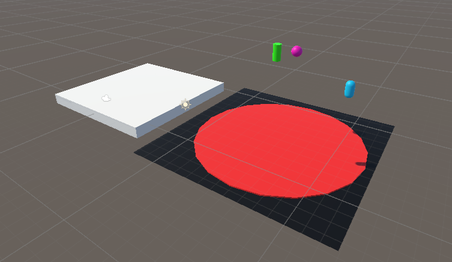

# Trampoline & Scorer

A simple Unity3D game scene where objects bounce off a trampoline and interact with a moving scoring platform.

---

## 🎮 Gameplay Overview

- **Prefabs** (Capsule, Sphere, Cylinder) randomly spawn and bounce on a trampoline.
- If a prefab lands on the **Scorer** platform (a white cube), the score increases by **10**.
- If a prefab drops below a certain height, it is destroyed and a **penalty of -2** is applied.

---

## 🛠️ Softwares Used

- **Unity**: Main game engine used to build the scene, handle physics, object spawning, and visual design.
- **Visual Studio**: Used to write and debug all C# scripts in the project.
  
---

## 📁 Project Structure

The Unity project is contained in a folder named **`Trampoline&Scorer/`**, and is organized as follows:

`Trampoline&Scorer/`
│
├── `Assets/`                         → Main working directory for all game assets  
│   ├── `Materials/`                  → Materials used in the scene (e.g., trampoline surface)  
│   ├── `Prefabs/`                    → Reusable prefabs like capsulepb, spherepb, cylinderpb  
│   ├── `Scenes/`                     → Scene files 
│   └── `Scripts/`                    → All custom C# scripts  
│       ├── `AI.cs`  
│       ├── `Controller.cs`  
│       ├── `PrefabSpawner.cs`  
│       ├── `Scorer.cs`  
│       └── `TrampolineBounce.cs`  
│
├── `Packages/`                      → Unity package dependencies  
├── `ProjectSettings/`               → Unity project settings and configurations  
├── `Library/`                       → Unity’s local cache (auto-generated)  
├── `.gitignore`                     → Git configuration to exclude system-generated files  
── `README.md`                       → Project documentation (this file)

---

## 🛠️ Components & Scripts

### 🔁 `PrefabSpawner.cs`
Attached to: **Each bouncing prefab**

- Spawns random prefabs at intervals.
- Links to the `Scorer` script.

### 🧠 `AI.cs`
Attached to: **Each prefab**

- Destroys the prefab if it falls below a certain height.
- Applies a score penalty.

### 🧱 `TrampolineBounce.cs`
Attached to: **The Trampoline**

- Applies an upward force on collision using a `PhysicMaterial`.

### 🧊 `Scorer.cs`
Attached to: **The Scorer Cube**

- Updates score on collision.
- Moves to random positions every few seconds.

### 🕹️ `Controller.cs`
Attached to: **The Scorer Cube (or other movable GameObject)**

- Handles input-based rotation using arrow keys or WASD.

---

## 🧩 Project Hierarchy

- `Assets/Scripts/`: All the C# logic.
- `Assets/Prefabs/`: Prefab GameObjects (capsule, sphere, cylinder).
- `Assets/Scenes/`: Your Unity scene file.
- `Assets/Materials/`: Materials like the trampoline's red surface, etc.

---

## ✅ Tags & Layers

Ensure the following:
- All bouncing prefabs are tagged as `"Cube"` for collision detection.
- Trampoline has a `PhysicMaterial` to simulate bounce.

---

## 📷 Screenshots

### 🖼️ Scene Setup

### 🟢 Active Game View

---

## 🚀 How to Play

1. Open the project folder (`Trampoline&Scorer`) in Unity.
2. Press ▶️ Play.
3. Watch prefabs spawn and bounce on the trampoline.
4. Try to catch them with the **Scorer** platform (the white cube).
5. The score will update by **+10** when caught, or **-2** when dropped.
6. ✅ **You can view the live score update in the Inspector** under the **Scorer** script component.

---

## 👤 Author

**Aobakwe Bogatsu**  
*Computer Systems Engineering student*

